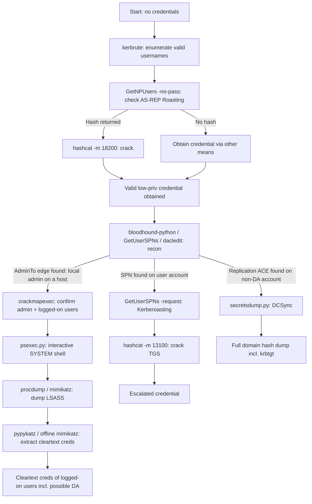

```mermaid
flowchart TD

    A[Start: no credentials] --> B[kerbrute: enumerate valid usernames]

    B --> C[GetNPUsers -no-pass: check AS-REP Roasting]

    C -->|Hash returned| D[hashcat -m 18200: crack]

    D --> E[Valid low-priv credential obtained]

    C -->|No hash| F[Obtain credential via other means]

    F --> E

    E --> G[bloodhound-python / GetUserSPNs / dacledit: recon]

    G -->|SPN found on user account| H[GetUserSPNs -request: Kerberoasting]

    H --> I[hashcat -m 13100: crack TGS]

    G -->|Replication ACE found on non-DA account| J[secretsdump.py: DCSync]

    G -->|AdminTo edge found: local admin on a host| K[crackmapexec: confirm admin + logged-on users]

    K --> L[psexec.py: interactive SYSTEM shell]

    L --> M[procdump / mimikatz: dump LSASS]

    M --> N[pypykatz / offline mimikatz: extract cleartext creds]

    I --> O[Escalated credential]

    J --> P[Full domain hash dump incl. krbtgt]

    N --> Q[Cleartext creds of logged-on users incl. possible DA]
```