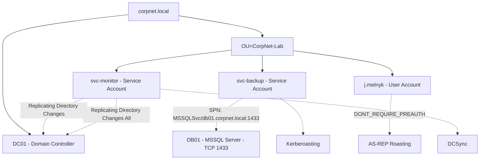

```mermaid
graph TD
    DOMAIN["corpnet.local"]

    DC["DC01 - Domain Controller"]
    OU["OU=CorpNet-Lab"]

    BACKUP["svc-backup - Service Account"]
    MELNYK["j.melnyk - User Account"]
    MONITOR["svc-monitor - Service Account"]

    DB["DB01 - MSSQL Server - TCP 1433"]

    KERB["Kerberoasting"]
    ASREP["AS-REP Roasting"]
    DCSYNC["DCSync"]

    DOMAIN --> DC
    DOMAIN --> OU

    OU --> BACKUP
    OU --> MELNYK
    OU --> MONITOR

    BACKUP -.->|"SPN: MSSQLSvc/db01.corpnet.local:1433"| DB
    BACKUP -.-> KERB

    MELNYK -.->|"DONT_REQUIRE_PREAUTH"| ASREP

    MONITOR -.->|"Replicating Directory Changes"| DC
    MONITOR -.->|"Replicating Directory Changes All"| DC
    MONITOR -.-> DCSYNC
```