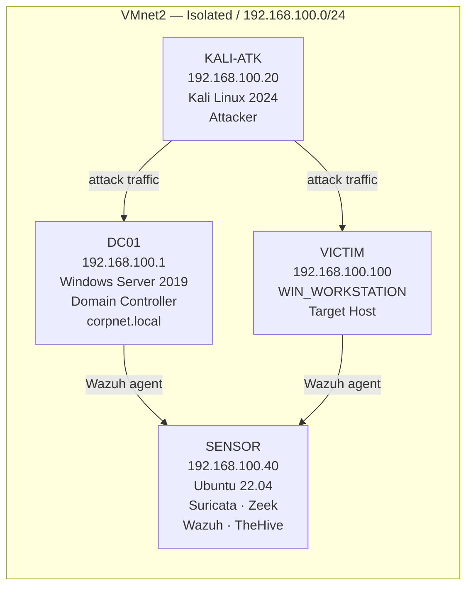

## Lab Architecture

| VM   | OS | IP | Role |
|---|---|---|---|
| DC01 | Windows Server 2019 |192.168.100.1  | Domain Controller (corpnet.local) |
| KALI-ATK | Kali Linux 2026 | 192.168.100.20 | Attacker | 
| SENSOR | Ubuntu 22.04 | 192.168.100.10 | IDS / SIEM / IR Platform |
| VICTIM | WIN_WORKSTATION | 192.168.100.100 | Target Host (Local Admin)

Host machine: *ThinkPad with Windows installed ·* VMware Workstation Domain: corpnet.local · Network: VMnet2 (host-only, fully isolated, no NAT)

## Lab Contents
### Block 1 — Active Directory Attack Chain
block1-attacks/

Four-step credential attack chain against the AD environment, each attack selected based on recon evidence — not run blindly.

| Attack | Technique | MITRE ATT&CK | Process Traces |
|---|---|---|---|
| Kerberoasting | Request RC4-encrypted TGS for SPN accounts | T1558.003 | Network only |
| AS-REP Roasting | AS-REQ without pre-auth for DONT_REQ_PREAUTH accounts | T1558.004 | Network only |
| DCSync | Abuse replication ACE to dump domain hashes | T1003.006 | Network only |
| LSASS Credential Dumping | Dump LSASS memory via procdump + pypykatz | T1003.001 | Host-side artifacts |

Tools: impacket · kerbrute · hashcat · netexec · bloodhound-python · pypykatz

## Block 2 — Network Detection
block2-detection/

Each attack from Block 1 detected using Suricata network signatures and Wazuh host-based rules, with the detection logic derived from the actual packet/log evidence — not from generic rule templates.

| Attack | Detection Method | Key Indicator |
|---|---|---|
| Kerberoasting | Suricata · Wazuh (Event 4769) | RC4 (etype 0x17) TGS-REQ burst |
| AS-REP Roasting | Suricata · Wazuh (Event 4768) | AS-REQ missing |PA-ENC-TIMESTAMP |
| DCSync| Suricata | DRSUAPI GetNCChanges from non-DC host |
| LSASS Dumping | Wazuh · Sysmon (Event ID 10) | Process handle opened on lsass.exe |

Tools: Suricata · Zeek · Wazuh · tshark · python-evtx

## Block 3 — Incident Response & Digital Forensics
block3-ir-forensics/

Full NIST SP 800-61r2 IR lifecycle applied to the Block 1 attack chain.

Detection → Analysis → Containment → Eradication → Recovery → Post-Incident

| Phase | Actions Performed | 
|---|---|
| Detection | Suricata + Wazuh correlation, TheHive case opened |
| Analysis | Disk imaging (dcfldd), memory forensics (Winpmem + Volatility3), AD log parsing (Event 4662/4768/4769), PCAP analysis (Zeek) |
| Containment | Network isolation, svc-monitor account disabled |
| Eradication | Dangerous ACE removed (dsacls), krbtgt rotated ×2, passwords reset |
| Recovery | DC01 restored from clean snapshot, detections re-verified |
| Post-Incident | Chain of custody finalized, lessons learned documented |

Tools: dcfldd · Winpmem · Volatility3 · TheHive · Wazuh · Zeek · pypykatz

Scope note: no physical Fortigate appliance in this lab — firewall flow logs are simulated in the documented Fortinet syslog format from real pcap timestamps and explicitly labeled as such.

Skills:

Offensive

Active Directory enumeration: LDAP, BloodHound, dacledit
Credential attacks: Kerberoasting, AS-REP Roasting, DCSync, LSASS dumping
Attack decision logic driven by recon output (SPN presence, DONT_REQ_PREAUTH flag, replication ACE analysis)

Defensive

IDS rule writing: Suricata (Kerberos app-layer keywords, DRSUAPI interface/opnum matching)
Host-based detection: Sysmon + Wazuh custom rules correlated against MITRE ATT&CK
Log forensics: Windows Security Event Log (4662/4768/4769), Zeek kerberos.log

Incident Response / DFIR

Disk imaging with verified chain of custody (dcfldd + SHA-256)
Memory forensics: LSASS process artifacts visible in Volatility3 pslist/handles
Full NIST SP 800-61r2 cycle documented per case in TheHive
krbtgt double-rotation post-DCSync eradication

⚠️ Disclaimer

This lab is fully isolated on a private VMnet2 segment with no external network access during attack execution. All techniques are documented for educational and portfolio purposes only. No external systems were targeted.

