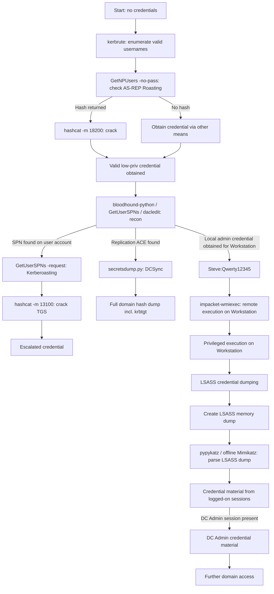

```mermaid

flowchart TD

    A[Start: no credentials] --> B[kerbrute: enumerate valid usernames]

    B --> C[GetNPUsers -no-pass: check AS-REP Roasting]

    C -->|Hash returned| D[hashcat -m 18200: crack]
    D --> E[Valid low-priv credential obtained]

    C -->|No hash| F[Obtain credential via other means]
    F --> E

    E --> G[bloodhound-python / GetUserSPNs / dacledit: recon]

    G -->|SPN found on user account| H[GetUserSPNs -request: Kerberoasting]
    H --> I[hashcat -m 13100: crack TGS]
    I --> O[Escalated credential]

    G -->|Replication ACE found| J[secretsdump.py: DCSync]
    J --> P[Full domain hash dump incl. krbtgt]

    G -->|Local admin credential obtained for Workstation| K[Steve:Qwerty12345]

    K --> L[impacket-wmiexec: remote execution on Workstation]

    L --> M[Privileged execution on Workstation]

    M --> N[LSASS credential dumping]

    N --> R[Create LSASS memory dump]

    R --> S[pypykatz / offline Mimikatz: parse LSASS dump]

    S --> T[Credential material from logged-on sessions]

    T -->|DC Admin session present| U[DC Admin credential material]

    U --> V[Further domain access]
```