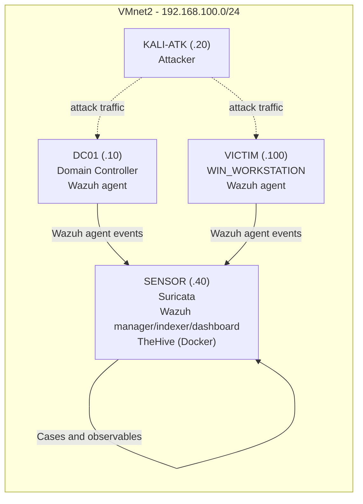

## Block 3 — Incident Response & Digital Forensics
Full NIST SP 800-61r2 Cycle Applied to the Block 1–2 Attack Chain
Lab: corpnet.local (isolated VMnet2, 192.168.100.0/24) Machines: DC01 (compromised host) · VICTIM (WIN_WORKSTATION, compromised host) · KALI-ATK (attacker) · SENSOR (Suricata + Wazuh manager + TheHive, via Docker) Objective: Take the Block 1 attack chain (Kerberoasting → AS-REP Roasting → DCSync) and the Block 2 detections, and run a complete Incident Response lifecycle against them — disk imaging, memory forensics, network/log forensics, case management, containment/eradication/recovery, and formal chain of custody.

Scope note: this lab has no physical Fortigate appliance. Fortigate traffic logs referenced below are simulated in the documented syslog format, generated from real pcap timestamps — this is explicitly disclosed rather than presented as genuine appliance output.


### 1. Architecture



### 2. Pre-Incident Preparation
#### 2.1 Forensic Workspace Setup (SENSOR)
```bash
# Dedicated, isolated evidence directory with restricted permissions

sudo mkdir -p /forensics/{disk_images,memory_dumps,pcaps,logs,evidence_log}

sudo chmod 700 /forensics

sudo chown $(whoami):$(whoami) -R /forensics
```
#### 2.2 Baseline Snapshot (Critical — Do This Before Any Attack Runs)
In VMware Workstation, snapshot DC01 and VICTIM in their clean state
```bash
vmrun snapshot "DC01.vmx" "clean-baseline"

vmrun snapshot "VICTIM.vmx" "clean-baseline"
```

#### 2.3 Tool Installation Checklist (SENSOR / KALI-ATK)

```bash
# Disk/memory forensics

sudo apt install dcfldd volatility3 -y

pip install volatility3 --break-system-packages
```
```bash
# Network forensics

sudo apt install zeek tshark -y
```
```bash
# Log parsing

pip install python-evtx --break-system-packages
```
*FTK Imager Lite: download separately (Windows-only), mount as VMware virtual CD/USB for DC01*


### 3. Phase 1 — DETECTION
(This phase reuses and extends Block 2's Suricata output, adding Wazuh host-based correlation.)
#### 3.1 Network Detection (Suricata, from Block 2)
Reuse rules sid:1000001 (Kerberoasting), 1000002 (AS-REP Roasting), 1000003 (DCSync) from block2-sensor-detection.md. Confirm they are still active:
```bash
sudo suricata -c /etc/suricata/suricata.yaml -i <interface>

tail -f /var/log/suricata/fast.log
```
#### 3.2 Host-Based Detection (Wazuh)
Step 1 — Deploy Wazuh manager stack on SENSOR
```bash
curl -sO https://packages.wazuh.com/4.9/wazuh-install.sh

sudo bash wazuh-install.sh -a
```
#### Step 2 — Install and register agents on DC01 and VICTIM
```powershell
# On DC01 (PowerShell, admin)

Invoke-WebRequest -Uri https://packages.wazuh.com/4.x/windows/wazuh-agent-4.9.0-1.msi -OutFile wazuh-agent.msi

msiexec.exe /i wazuh-agent.msi /q WAZUH_MANAGER="192.168.100.40"

NET START WazuhSvc
```
```bash
# On VICTIM (Linux)

curl -o wazuh-agent.deb https://packages.wazuh.com/4.x/apt/pool/main/w/wazuh-agent/wazuh-agent_4.9.0-1_amd64.deb \

  && WAZUH_MANAGER="192.168.100.40" dpkg -i ./wazuh-agent.deb

sudo systemctl enable wazuh-agent --now
```

#### Step 3 — Enable Windows Security Log forwarding on DC01

Confirm Advanced Audit Policy captures Kerberos operations (needed for Event IDs 4768/4769/4662):
```powershell
auditpol /set /subcategory:"Kerberos Service Ticket Operations" /success:enable /failure:enable

auditpol /set /subcategory:"Kerberos Authentication Service" /success:enable /failure:enable

auditpol /set /subcategory:"Directory Service Access" /success:enable /failure:enable
```

#### Step 4 — Custom Wazuh rule correlating RC4 Kerberos tickets (mirrors the Suricata logic at host level)

Edit /var/ossec/etc/rules/*local_rules.xml* on SENSOR:
```xml

<group name="windows,kerberos,kerberoasting">

  <rule id="100010" level="10">

    <if_group>windows</if_group>

    <field name="win.eventdata.ticketEncryptionType">0x17</field>

    <description>Possible Kerberoasting: RC4 (0x17) TGS ticket requested for event 4769</description>

    <mitre>

      <id>T1558.003</id>

    </mitre>

  </rule>

</group>
```

Step 5 — Restart Wazuh to load the rule
```bash
sudo systemctl restart wazuh-manager
```
3.3 Cross-Validation
Deliberately re-run one-by-one attacks from Block 1 against the restored baseline, and confirm both alerts fire — Suricata (network) and Wazuh (host) — for the same event, within seconds of each other. Document the timestamp delta.
