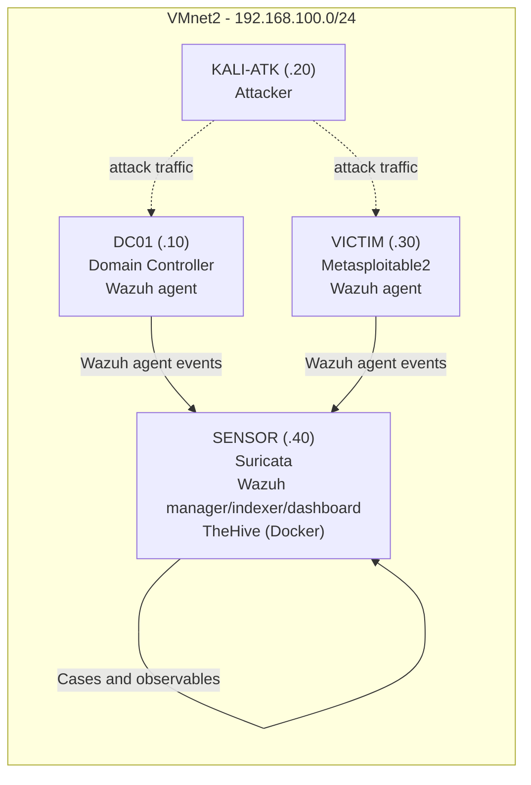

## Block 3 — Incident Response & Digital Forensics
Full NIST SP 800-61r2 Cycle Applied to the Block 1–2 Attack Chain
Lab: corpnet.local (isolated VMnet2, 192.168.100.0/24) Machines: DC01 (compromised host) · VICTIM (Metasploitable2, compromised host) · KALI-ATK (attacker) · SENSOR (Suricata + Wazuh manager + TheHive, via Docker) Objective: Take the Block 1 attack chain (Kerberoasting → AS-REP Roasting → DCSync) and the Block 2 detections, and run a complete Incident Response lifecycle against them — disk imaging, memory forensics, network/log forensics, case management, containment/eradication/recovery, and formal chain of custody.

Scope note: this lab has no physical Fortigate appliance. Fortigate traffic logs referenced below are simulated in the documented syslog format, generated from real pcap timestamps — this is explicitly disclosed rather than presented as genuine appliance output.

### Architecture

